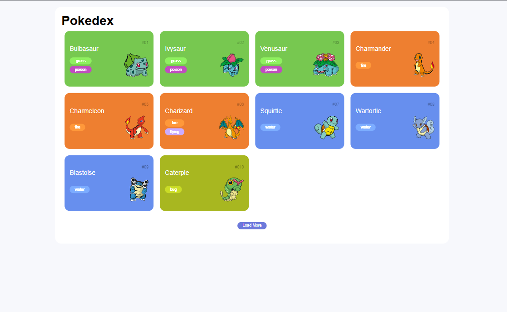

# Pokedex
Projeto realizado junto a [DIO](https://www.dio.me/sign-up?ref=TQGOYNU5LQ), sob orientação do professor Renan Johannsen. A proposta do projeto é construir uma Pokedex trazendo informações da API oficial do Pokémon, integrando e tratando as informações.

Durante o curso o professor Renan mostrou como realizar a integração e a construção da 1° parte da Pokedex, que foram os Pokémons com algumas informações básicas como o número, nome, tipo e a foto. Como desafio ele deixou a criação da segunda tela com detalhes mais aprofundados dos Pokémons.

## 📒 Aprendizados
- Na construção de uma aplicação responsiva iniciar a construção pelo modelo mobile ajuda bastante na hora de ajustar para telas maiores, e o uso das media query facilita ainda mais o trabalho.
- Integrar código a API externa e manipular os dados através do próprio código selecionando e personalizando as informações conforme desejamos utilizar.
- Funcionamento das requisições e como manipular as informações obtidas nas requisições.
- Trabalhando paginação para carregar mais informações na tela.
- Separar os códigos ajuda a melhorar a organização do projeto.

## 🤖 Tecnologias Utilizadas
- HTML
- CSS
- JavaScript
- PokéAPI

##  🛠️ Melhorias
- Inclusão de background
- 

## 🚀 Resultados

### Inspiração

### O curso

### Resultado Final

## 🔗 Links Úteis

- Pokedex: http://pokemon.com/br/pokedex
- Modelo Pokedex: https://dribbble.com/shots/6540871-Pokedex-App/attachments/6540871-Pokedex-App?mode=media
- PokeAPI Documents: https://pokeapi.co/docs/v2#pokemon
- PokeAPI Image: https://raw.githubusercontent.com/PokeAPI/sprites/master/sprites/pokemon/other/dream-world/1.svg
- PokeAPI Details: https://pokeapi.co/api/v2/pokemon/1
- Response json() method: https://developer.mozilla.org/en-US/docs/Web/API/Response/json
